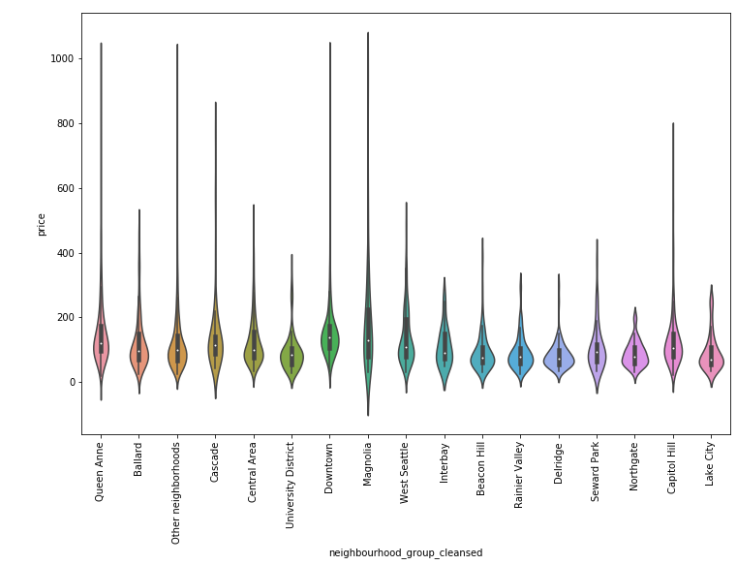
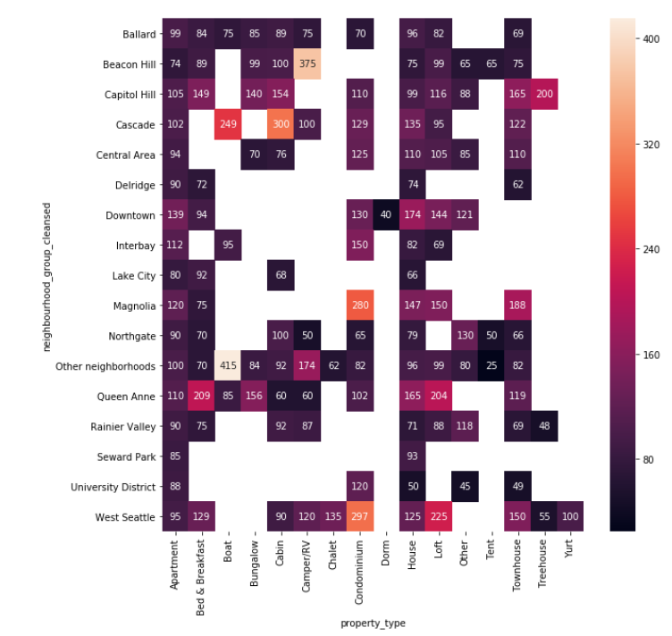

## [Overview](../index.md)

## [Read and Assess](.../read_assess/read_assess.md)

## [Preprocessing](preprocessing/cleaning.md)

# Analyze and Visualize

## [Model Building](.../model_building/model.md)

## [Conclusion](.../conclusion/conclusion.md)


### Feature Analysis and Visualization

In this section, we seek to explore features relationship with price. we will explore and answer questions:

1. **Geographic influence on price and listings distirbution:** how's the distribution of listings by geo? Which districts with most expensive listing?.

2. **How the categorical variables affect the price:** categorical variables include bedrooms, property types, room types and amenities.

3. **What are the seasonality of price and number of available listings in seattle?** 


These features hope to serve as data points that will help us better create a model that accurately outputs the predicted price for which a listing should be priced at.


### Distribution of price

The price data is highly right skewed and with peak price at USD 65, 100, 150, 200, 250 and 300. Also, we can see that most of Airbnb price in seattle within range USD 65 ~ 150


```python
def plot_hist(n, titles, ranges):
    
    '''
    INPUT: 
    n - integer for subplots
    title - list of titles
    ranges - list of values
    
    OUTPUT:
    None

    '''
    
    fig, ax = plt.subplots(n, figsize = (8, 7.5))
    for i in range(n):
        d, bins, patches = ax[i].hist(ranges[i], 50, normed = 1, color = BNB_RED, alpha = 0.85)
        ax[i].set_title(titles[i])
        ax[i].set_xlabel("Daily Listing Price in Dollars")
        ax[i].set_ylabel("Frequency")
    plt.tight_layout()
    plt.show()
    
# Visualize price table, changing them to floats and replacing the commas with a blank
prices = listings['price']

# plot histograms
n = 3
titles = ['Distribution of Listing Prices: All Date',
          'Distribution of Listing Prices: \$0 - \$500',
          'Distribution of Listing Prices: \\$0 - \$250'
         ]
ranges = [prices, prices[prices <= 500], prices[prices <= 300]]
plot_hist(n, titles, ranges)
```


### Q1. how's the distribution of listings by geo? Which districts with most expensive listing?

We can see that the top three districts are roughly in the downtown Seattle area namely Capitol Hill and Central Area.The next most popular is Quee Anne. The pirce within downtown is larger than 100. Besides, the downtown has large number of listing with price higher than 200, especially the place near the Space Niddle. The median price in Queen Anne, downtown and Cascade is higher than others (150+ USD).

```python
intervals = [0,100,200,10000]
leg_labels = []

# Get Labels for legend
for i in range(0,len(intervals) - 1):
    if i == len(intervals) - 2:
        leg_labels.append('\${}+'.format(intervals[i]))
    else:
        leg_labels.append("\${}-\${}".format(intervals[i], intervals[i+1]))    

buckets = []

# Divide up into price buckets
for i in range(0, len(intervals) - 1):
    buckets.append(listings[(prices > intervals[i]) & (prices < intervals[i+1])])
    


colors = [BNB_LIGHT_GRAY,'yellow', BNB_RED]
alphas = [0.85, 0.85, 0.85]  

# Plot listings on scatterplot
plt.figure(figsize=(15, 15))
for i in range(0, len(buckets)):
    plt.scatter(buckets[i]['longitude'], buckets[i]['latitude'], alpha = alphas[i], c=colors[i], s=25)

neighbours = listings.groupby(['neighbourhood_group_cleansed'])['longitude','latitude'].median().reset_index()
for j in range(neighbours.shape[0]):
#     print(neighbours.iloc[j])
    plt.text(neighbours['longitude'][j],neighbours['latitude'][j]
             ,neighbours['neighbourhood_group_cleansed'][j],fontsize = 12)

    
plt.title('Seattle Airbnb Listings')
plt.xlabel('Latitude')
plt.ylabel('Longitude')
plt.legend(labels=leg_labels, loc = 'best')


plt.show()
```


```python
# violin plot of price by neighborhoods
plt.figure(figsize=(12,8))
sns.violinplot('neighbourhood_group_cleansed', 'price', data = listings, size = 5, aspect = 2)
xt = plt.xticks(rotation=90)
```


### Q2. how the categorical variables affect the price?

#### Bedrooms

The most listings provide 1 bedrooms. The more bedrooms the higher price. By combinding with neighborhood, we can see that Captitol Hill, Other neighborhoods and Queen Anne have listing with bedrooms larger than 6. The Captitol Hill, Queen Anne and Cascade have listings with median price higher than 673 as bedrooms larger than 5, which is more expensive than others 


```python
# Bedrooms distribution
bedrooms_counts = Counter(listings.bedrooms)
bedrooms_percent = pd.DataFrame.from_dict(bedrooms_counts, orient = 'index').sort_values(by = 0)
bedrooms_percent = (bedrooms_percent.iloc[-6:,:]/listings_b.shape[0]) * 100

# sort bedrooms dataframe by numbere
bedrooms_percent.sort_index(axis = 0, ascending = True, inplace = True)

# plot percent of listings by bedroom number
ax = bedrooms_percent.plot(kind = 'bar', figsize = (12,4), color = BNB_BLUE, alpha = 0.85)
ax.set_xlabel('Number of Bedrooms')
ax.set_ylabel('Percent of Listings %')
ax.set_title('Percent of Listing by Bedrooms')
ax.legend_.remove()

plt.show()
```


```python
# Heatmap of price by bedrooms and neighborhoods
plt.figure(figsize=(10,10))
ax = sns.heatmap(listings.groupby([
        'neighbourhood_group_cleansed', 'bedrooms']).price.median().unstack(),annot=True, fmt=".0f")
bottom, top = ax.get_ylim()
ax.set_ylim(bottom + 0.5, top - 0.5)
```


#### Property Types

**Apartment,Boungalow, Chalet, House, Loft, Other,Townhouse** - no big difference in median price among districts;
**Bed & Breakfast** - the median price in Queen Anne is higher than others (200+ USD)
**Boat** - five districs provide this type and Other neighborhoods with highest median price (415 USD); The entire Bost is most expensice price than others
**Carbin** - the Cascade have most expensive median price, which is far more than others
**Camper/RV** - the Beacon Hill have most expensive price, which is far more than others
**Chalet** - Other neighborhoods and west seatlte provide this type and west seattle is more expensive
**Condominium** - the price at Magnolia and West seattle is far more than others
**Dorm** - only Downtown has this type and it is cheap, which is with median price 40 USD
**Ten** - Beacon Hill, Northgate and Other neighborhoods provide this type and there is no big difference in median price
**Treehouse** - Capitol Hill, Quee Anne and West seattle provide this; The median price at Capitol Hill is far more than others
**Yurt** - only West seattle provide this type


```python
# Heat Map
plt.figure(figsize=(10,10))
ax = sns.heatmap(listings.groupby([
        'neighbourhood_group_cleansed', 'property_type']).price.median().unstack(),annot=True, fmt=".0f")
bottom, top = ax.get_ylim()
ax.set_ylim(bottom + 0.5, top - 0.5)
```





```python
# Heatmap to property_type and room_type
plt.figure(figsize=(10,10))
ax = sns.heatmap(listings.groupby([
        'property_type', 'room_type']).price.median().unstack(),annot=True, fmt=".0f")
bottom, top = ax.get_ylim()
ax.set_ylim(bottom + 0.5, top - 0.5)
```


#### Amenities
The top three popular amenities are Internet, Wireless Internet and Heating (95%+ listings). The amenities Cable TV, Indoor Fireplace and Air Conditions with median price larger than 150 USD, which is higher than others; but they are not very common in listings; the percent of listins have these are lower than 51%.

```python
# Calculate mean price and % of listings with certain amenity
amenities_cols =  listings.columns[-30:]
amenities_df = pd.DataFrame(columns = ['amenities','% listings with certain amenity','price'])
amenities = []
percent_listing = []
price = []
for a_col in amenities_cols:
    amenities.append(a_col.split('_')[1])
    percent_listing.append(round(listings[listings[a_col] == 1][a_col].sum()/listings.shape[0] * 100,1))
    price.append(listings[listings[a_col] == 1]['price'].mean())   

amenities_df['amenities'] = amenities
amenities_df['% listings with certain amenity'] = percent_listing
amenities_df['price'] = price
amenities_df = amenities_df.sort_values(by = ['% listings with certain amenity'], ascending = False)

# plot heatmap to show result
plt.figure(figsize=(10,10))
ax = sns.heatmap(amenities_df.groupby([
        'amenities','% listings with certain amenity']).price.mean().unstack(),annot=True, fmt=".0f")
bottom, top = ax.get_ylim()
ax.set_ylim(bottom + 0.5, top - 0.5)
```


### Q3. What are the seasonality of price and number of available listings in seattle?

To observe the effect of seasonality on listing price, I draw the plot to show how number of available listings and mean price changed by month in 2016

As we can see, there is a negative correlation beteern number of available listings and mean price by month. The summer and winter holidays are the busiest time to visit Seattle. The summer holidays with highest price in a year.


```python
#find number of total number of listings for each month in 2016
number_of_listings_by_month = pd.Series([12])
for i in range(1, 13):
    number_of_listings_by_month[i] = len(seattle_df[(seattle_df['month'] == i) & (seattle_df['year'] == 2016)]['listing_id'].unique())
    
number_of_listings_by_month = number_of_listings_by_month.drop(0)

#plot
plt.figure(figsize=(10,5))
plt.plot(number_of_listings_by_month)
plt.xticks(np.arange(1, 13, step=1))
plt.ylabel('Number of listings')
plt.xlabel('Month')
plt.title('Number of listings per month, 2016')

plt.savefig('number of available listings.png')

plt.show()
```


```python
# average price by month
average_price_by_month = seattle_df.groupby(['month'])['price'].mean()

#plot
plt.figure(figsize=(10,5))
plt.plot(average_price_by_month)
plt.ylabel('Average price, $')
plt.xlabel('Month')
plt.title('Average price')

plt.savefig('average price for month')

plt.show()
```


