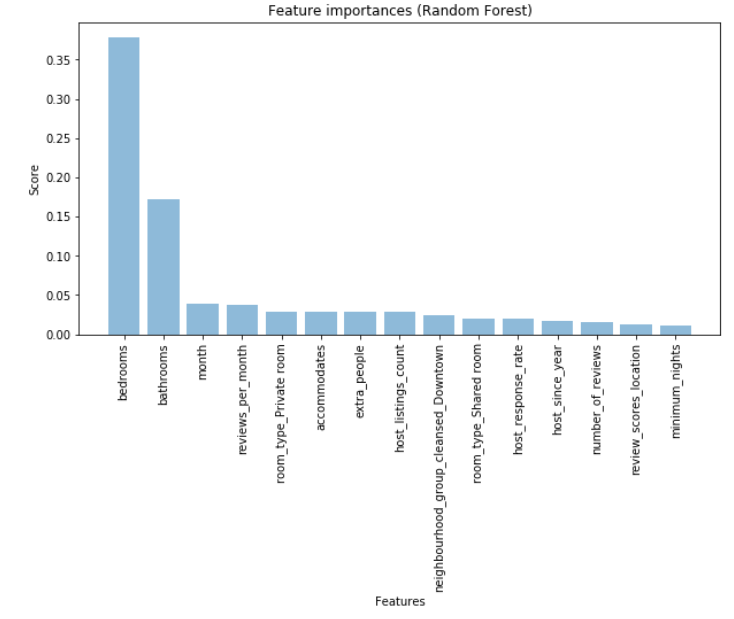

## [Overview](.../index.md)

## [Read and Assess](.../read_assess/read_assess.md)

## [Preprocessing](.../preprocessing/cleaning.md)

## [Analyze and Visualize](.../analyze_visualize/analyze_visualize.md)

# Model Building

## [Conclusion](.../conclusion/conclusion.md)


### Model Selection and Tuning
After cleanng and visualizing data, I applyed machine learning method to see predict price and see which features in dataset influence the price most. In order to do this, I train Random Forest regressor based on decision trees and look at resulting feature importance

#### Q4. Which features in dataset influence the price most?

The variable importance feature selection is taken from Random Forest model. I calculated predictor importance, sorted and plot top 15 predictors on a horizontal bar chart, highlighting the most important featuers at the top and the less important features at the bottom of the graph.

The modeling show that factors have influence on price: bedrooms, bathrooms, month (seasonality), room_type and accommodates. Also, the host qualities are important: number of host's listings, number of years since being the host and host response rate. Last, the price might changed by the number of reviews per month, review scores and number of reviews.

```python
#turn categorical columns into dummies
cat_columns = list(seattle_df.select_dtypes(include=['object']).columns)
    
for col in  cat_columns:
    seattle_df = pd.concat([seattle_df.drop(col, axis=1), pd.get_dummies(seattle_df[col], prefix=col, prefix_sep='_',

                                                         drop_first=True, dummy_na=True)], axis=1)
#drop listing_id and year columns
seattle_df = seattle_df.drop(columns = ['host_response_time','host_is_superhost','host_has_profile_pic'
                                        ,'host_identity_verified','listing_id','year','date','longitude','latitude'])
# seattle_df.head()
X = seattle_df.drop(columns = 'price')
y = seattle_df[['price']]

X_train, X_test, y_train, y_test = train_test_split(X, y, test_size = 0.3, random_state = 42)

#train RF regressor model
forest = RandomForestRegressor(n_estimators=100, 
                               criterion='mse', 
                               random_state = 42, 
                               n_jobs=-1)
forest.fit(X_train, y_train.squeeze())

#calculate scores for the model
y_train_preds = forest.predict(X_train)
y_test_preds = forest.predict(X_test)

print('Random Forest MSE train: %.3f, test: %.3f' % (
        mean_squared_error(y_train, y_train_preds),
        mean_squared_error(y_test, y_test_preds)))
print('Random Forest R^2 train: %.3f, test: %.3f' % (
        r2_score(y_train, y_train_preds),
        r2_score(y_test, y_test_preds)))
```

    Random Forest MSE train: 186.669, test: 211.225
    Random Forest R^2 train: 0.983, test: 0.981


#### Get top 15 important feature 


```python
#get feature importances from the model
headers = ["name", "score"]
values = sorted(zip(X_train.columns, forest.feature_importances_), key=lambda x: x[1] * -1)
forest_feature_importances = pd.DataFrame(values, columns = headers)
forest_feature_importances = forest_feature_importances.sort_values(by = ['score'], ascending = False)

features = forest_feature_importances['name'][:15]
y_pos = np.arange(len(features))
scores = forest_feature_importances['score'][:15]

#plot feature importances
plt.figure(figsize=(10,5))
plt.bar(y_pos, scores, align='center', alpha=0.5)
plt.xticks(y_pos, features, rotation='vertical')
plt.ylabel('Score')
plt.xlabel('Features')
plt.title('Feature importances (Random Forest)')

plt.savefig('feature importances RF.png')
 
plt.show()
```




