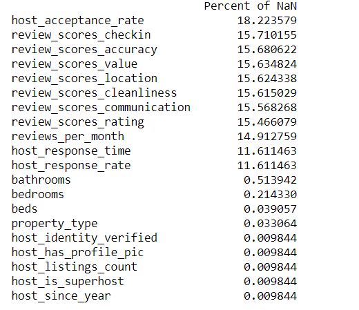
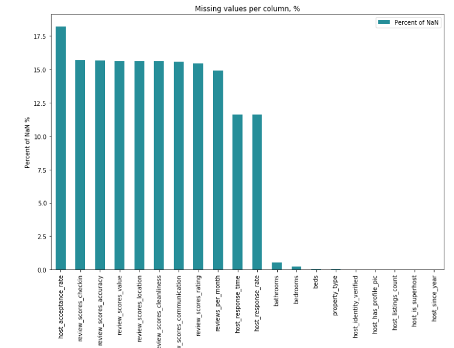
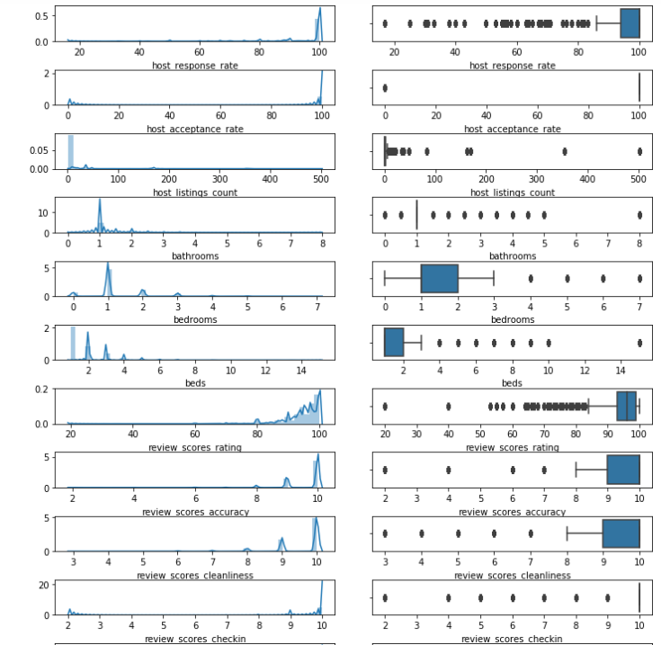

## [Overview](.../index.md)

## [Read and Assess](.../read_assess/read_assess.md)

# Preprocessing

## [Analyze and Visualize](.../analyze_visualize/analyze_visualize.md)

## [Model Building](.../model_building/model.md)

## [Conclusion](.../conclusion/conclusion.md)

### Cleaning and Preprocessing Airbnb Data
the Airbnb datasets provided need to be cleaned and edited for optimal model usage. This includes performing initial feature selection, imputing missing data, performing variable transformations, and further pre-processing.


## Define function to preprocess data
```python
# create dummy column for columns with multiple categories
def replace_v(x):
    res = x.replace("'",'').replace("]",'').replace('"','').replace('{','').replace('}','')
    return res

def get_val_dict(df, column):
    values_dict = {}
    for unique_value in df[column].unique():
        unique_value = replace_v(unique_value)
        for value in unique_value.split(','):
            if value in values_dict:
                values_dict[value] += 1
            else:
                values_dict[value] = 0
    
    values_dict = sorted(values_dict.items(), key = lambda kv: kv[1], reverse = True)
    return values_dict

def fill_dummy_col(row, column,item):
    val = 0
    try:
        items = replace_v(row[column])
        if item in items:
            val = 1
    except:
        val = 0
    return val

def create_dummy_col(df, column, max_dummies_num):
    '''
    INPUT:
    df - dataframe
    column - the column name of column with multiple items in each cell
    max_dummies_num - the limitation of # of dummy variable
    
    OUTPUT:
    df - the new dataframe with dummy variable and the deleted original column
    
    '''
    
    values_dict = get_val_dict(df,column)
    for value in values_dict[:max_dummies_num]:
        item = value[0]
        df[column + '_' + item] = df.apply(lambda row: fill_dummy_col(row,column,item), axis = 1)
        
    df = df.drop([column],axis = 1) # drop original column
    
    return df

# preprocess date

def get_month(date):
    month = datetime.strptime(date,'%Y-%m-%d').month
    return month

def get_year(date):
    try:
        year = datetime.strptime(date,'%Y-%m-%d').year
    except:
        year = np.nan
    return year

def req_extral_people_fee(fee):
    '''
    INPUT:
    fee - the requested fee for an extral people
    
    OUTPUT:
    res - 1/0 indicator for request extral people fee
    '''
    
    if fee == '$0.00':
        return 0
    else:
        return 1
    
# convert price to float
def convert_price(price):
    price = float(price.replace('$','').replace(',',''))
    return price

# convert rate data to float
def convert_rate(rate):
    if pd.notna(rate):
        rate = float(rate.replace('%',''))
    return rate
    
# fill NaN
def fill_mean(df,col):
    return df[col].fillna(df[col].mean())

def fill_mode(df,col):
    return df[col].fillna(df[col].mode()[0])

def fill_median(df,col):
    return df[col].fillna(df[col].median())
```

## Preprocess listings data

```python
# preprocess listings
listings['price'] = listings['price'].apply(convert_price)
listings['extra_people'] = listings['extra_people'].apply(convert_price)

# process rate data
listings['host_response_rate'] = listings['host_response_rate'].apply(convert_rate)
listings['host_acceptance_rate'] = listings['host_acceptance_rate'].apply(convert_rate)

# get host since year
listings['host_since_year'] = listings['host_since'].apply(get_year)
listings = listings.drop('host_since',axis = 1)

# create dummy column for host verification
create_dummy_col(listings,'host_verifications',10)
listings = listings.drop('host_verifications',axis = 1)

# create dummy column for amenities and calculate amenities num
create_dummy_col(listings, 'amenities',30)
listings = listings.drop('amenities', axis = 1)
# listings['amenities_num'] = listings['amenities'].apply(lambda x: len(replace_v(x).split(',')))

listings = listings.rename({'host_verifications_[email':'host_verifications_email'}, axis = 1)

```


### Merge listings and calendar data; Drop irrelevant columns

To evaluate the influence of date on price. I merged calendar and listings data. 

```python
To evaluate the influence of date on price. I merged calendar and listings data. 
# merge calendar and listings
listings = listings.rename(columns = {'id': 'listing_id'})
seattle_df = pd.merge(calendar, listings, on = 'listing_id')
seattle_df = seattle_df.iloc[:,:-20]


    
# drop irrelevant columns 
col_to_drop = ['listing_url','scrape_id','name','summary','space','description','experiences_offered','neighborhood_overview'
               ,'notes','transit','thumbnail_url','medium_url','picture_url','xl_picture_url' ,'host_id','host_url'
               ,'host_name','host_location','host_about','host_thumbnail_url','host_picture_url','host_total_listings_count'
               ,'host_neighbourhood','street','neighbourhood','neighbourhood_cleansed','city','state','zipcode','market'
               ,'smart_location','country_code','is_location_exact','weekly_price','monthly_price','security_deposit'
               ,'cleaning_fee','guests_included', 'calendar_updated','has_availability','availability_30','availability_60'
               ,'availability_90','availability_365','calendar_last_scraped','first_review','last_review','requires_license'
               ,'license','jurisdiction_names','require_guest_profile_picture','square_feet','price_y','available'
               ,'last_scraped','country','require_guest_phone_verification','calculated_host_listings_count']

seattle_df = seattle_df.drop(col_to_drop,axis = 1)

# drop the row where price = NaN and convert to float
seattle_df = seattle_df.dropna(subset = ['price_x']).reset_index()
seattle_df = seattle_df.drop(['index'],axis = 1)
seattle_df = seattle_df.rename({'price_x':'price'}, axis = 1)

# get month and year
seattle_df['month'] = seattle_df['date'].apply(get_month)
seattle_df['year'] = seattle_df['date'].apply(get_year)

seattle_df.head()
```
<div>
<table border="1" class="dataframe">
  <thead>
    <tr style="text-align: right;">
      <th></th>
      <th>listing_id</th>
      <th>date</th>
      <th>price</th>th>
      <th>...</th>
      <th>amenities_TV</th>
    </tr>
  </thead>
  <tbody>
    <tr>
      <th>0</th>
      <td>241032</td>
      <td>2016-01-04</td>
      <td>85.0</td>
      <td>...</td>
      <td>1</td>
    </tr>
    <tr>
      <th>1</th>
      <td>241032</td>
      <td>2016-01-05</td>
      <td>85.0</td>
      <td>...</td>
      <td>1</td>
    </tr>
    <tr>
      <th>2</th>
      <td>241032</td>
      <td>2016-01-13</td>
      <td>85.0</td>
      <td>...</td>
      <td>1</td>
    </tr>
  </tbody>
</table>
</div>


## Check the NaN

```python
# NA of seattle_df
plot_na(seattle_df,(12,8))
```





#### distribution of columns with missing value
To decide how to fill NaN, I review the distribution of columns with missing value. 


```python
# distribution of missing column
nan_cols = seattle_df.columns[(seattle_df.isna().mean() > 0) & (seattle_df.dtypes == 'float64')]
n_plots = len(nan_cols)
fig, axes = plt.subplots(nrows = n_plots, ncols = 2, figsize = (10,15))
fig.tight_layout()
for i in range(n_plots):
    col_notnull = seattle_df[seattle_df[nan_cols[i]].notnull()][nan_cols[i]]
    sns.distplot(col_notnull, ax = axes[i,0])
    sns.boxplot(col_notnull, ax = axes[i,1])
    
plt.show()
```




### Fill NaN
Since the distribution of these columns is highly skewed, I used median and mode to fill NaN


```python
nan_cols = seattle_df.columns[seattle_df.isna().mean() > 0].tolist()
for nan_col in nan_cols:
    if seattle_df[nan_col].dtypes == 'object':
        seattle_df[nan_col] = fill_mode(seattle_df, nan_col)
    if seattle_df[nan_col].dtypes == 'float64':
        seattle_df[nan_col] = fill_median(seattle_df,nan_col)
        
seattle_df.head()
```
<div>
<table border="1" class="dataframe">
  <thead>
    <tr style="text-align: right;">
      <th></th>
      <th>listing_id</th>
      <th>date</th>
      <th>price</th>th>
      <th>...</th>
      <th>amenities_TV</th>
    </tr>
  </thead>
  <tbody>
    <tr>
      <th>0</th>
      <td>241032</td>
      <td>2016-01-04</td>
      <td>85.0</td>
      <td>...</td>
      <td>1</td>
    </tr>
    <tr>
      <th>1</th>
      <td>241032</td>
      <td>2016-01-05</td>
      <td>85.0</td>
      <td>...</td>
      <td>1</td>
    </tr>
    <tr>
      <th>2</th>
      <td>241032</td>
      <td>2016-01-13</td>
      <td>85.0</td>
      <td>...</td>
      <td>1</td>
    </tr>
  </tbody>
</table>
</div>
